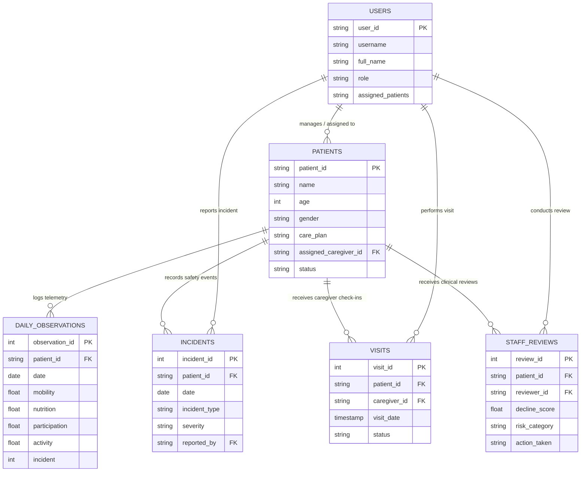

WEB URL : https://care-pulse.streamlit.app/

# CARE PULSE — Home-Care Early Functional Decline Detection

CARE PULSE is an explainable clinical decision-support platform for identifying **early, longitudinal functional decline** in home-care patients from observational telemetry. It compares trailing 7-day observations against an individualized 14-day baseline across mobility, nutrition, participation, activity, and incident history, then presents transparent risk signals for clinical review.

> **Important:** CARE PULSE is a prototype decision-support system. It does not diagnose medical conditions, prescribe treatment, or replace professional clinical judgement.

---

## System Architecture & Technology Stack

- **Core Engine:** Python 3.10
- **Web UI & Visualization:** Streamlit, Plotly, Custom Vanilla CSS
- **Data Engineering & Analytics:** Pandas, NumPy, Scikit-learn
- **Database Persistence Layer:** SQLite / PostgreSQL Compatible Schema (`database/schema.sql`)
- **Automated Testing & Assurance:** Pytest

```text
CARE_PULSE_FINAL/
├── app.py                      # Main Application Entry Point & Page Router
├── security.py                 # Centralized RBAC Security & Patient Scoping Engine
├── requirements.txt            # Project Dependencies
├── README.md                   # System Documentation & Specifications
├── sample_10_patients.csv      # Sample Patient Dataset
├── care.csv                    # Primary Production Observation Dataset
│
├── database/                   # Database Persistence Schema
│   └── schema.sql              # SQL DDL Schema (Users, Patients, Telemetry, Incidents)
│
├── analysis/                   # Core Analytics & Decision-Support Algorithms
│   ├── baseline.py             # Single-Metric Baseline Evaluator
│   ├── data_cleaning.py        # Ingestion, Inspection & Quality Engine
│   ├── decline_score.py        # 0–100 Functional Decline Scoring Engine
│   ├── experiment.py           # Simulation Workbench & Evaluation Engine
│   ├── metrics.py              # Population-Level Metrics Aggregator
│   ├── ml_model.py             # Machine-Learning Baseline Classifier
│   ├── pipeline.py             # End-to-End Analytics Pipeline Orchestrator
│   └── trend_analysis.py       # 14d vs 7d Baseline Trend Engine
│
├── data/                       # Data Generators & Sample Files
│   ├── generate_synthetic.py   # Synthetic Observation Generator
│   ├── sample_10_patients.csv  # 10-Patient Benchmark Dataset
│   └── sample_patients.csv     # General Sample Observations
│
├── ui/                         # Streamlit Component Modules
│   ├── alerts.py               # Triage & Early Decline Alert Queue
│   ├── components.py           # Reusable UI Badges, Cards & Widgets
│   ├── dashboard.py            # Population Overview & Metric Cards
│   ├── evidence.py             # XAI Audit & Evidence View
│   ├── experiment_page.py      # Early Detection Simulation Workbench View
│   ├── patients.py             # Patient Profile & Longitudinal Charting
│   ├── styles.py               # Medical Theme & Custom CSS Utility
│   └── upload.py               # Data Ingestion & Quality Audit View
│
├── utils/                      # System Utilities & Helper Functions
│   ├── helpers.py              # Formatting & Session State Initialization
│   └── validation.py           # Schema & Range Validation Engine
│
└── tests/                      # Pytest Automated Test Suite
    ├── test_analysis.py        # Unit Tests for Trend & Scoring Engine
    ├── test_coe_requirements.py# COE Clinical Requirement Edge-Case Suite
    ├── test_ml_model.py        # End-to-End Pipeline Execution Tests
    ├── test_rbac.py            # Role-Based Access Control Unit Tests
    └── test_validation.py      # Data Quality & CSV Validation Tests
```

---

## Testing Strategy

The CARE PULSE platform includes a comprehensive, automated unit and integration test suite (`tests/`) executed via `pytest`. The test suite covers data cleaning, CSV schema validation, 14d vs 7d trend computation, 0–100 functional decline scoring, data freshness tracking, missing telemetry handling, and Role-Based Access Control (RBAC).

### Key Components Tested:
1. **CSV & Telemetry Validation (`test_validation.py`):** Tests raw input DataFrames against required column schemas, date parseability, duplicate detection, zero/missing values, and out-of-bounds metric values.
2. **Trend & Decline Scoring (`test_analysis.py`):** Verifies that stable patients maintain low scores ($<30.0$) and that multi-domain drops correctly increase decline scores into review thresholds ($\ge 30.0$).
3. **Clinical COE Edge-Case Scenarios (`test_coe_requirements.py`):** Tests 5 core clinical scenarios: continuous normal observations, missing domain metrics, observation gaps, stale data latency, and insufficient history ($<4$ records).
4. **Pipeline Execution (`test_ml_model.py`):** Evaluates end-to-end processing pipelines across multi-patient cohorts.
5. **Security & RBAC Controls (`test_rbac.py`):** Validates permission matrices for Caregiver, Supervisor, Authorized Staff, and Admin roles, page access boundaries, patient assignment filtering, and 403 access control.

### Automated Test Suite Summary Table

| Test Module | Functionality Tested | Main Scenarios & Test Cases |
| :--- | :--- | :--- |
| **`test_validation.py`** | CSV Data Validation & Schema Inspection | • `test_valid_csv`: Standard valid CSV ingestion.<br>• `test_missing_columns`: Detects missing mandatory columns (`mobility`, etc.).<br>• `test_invalid_dates_and_duplicates`: Identifies invalid date strings and duplicate `(patient_id, date)` records.<br>• `test_empty_dataframe`: Blocks parsing of empty files.<br>• `test_case_6_duplicate_patient_date`: Validates duplicate record count tracking.<br>• `test_case_7_invalid_metric_range`: Flags out-of-range metrics (e.g., Mobility=15, Nutrition=120). |
| **`test_analysis.py`** | Trend Analysis & Score Computation | • `test_data_cleaning`: Verifies column lowercasing and value clipping.<br>• `test_stable_patient_trend`: Validates score $<30.0$ (`Doing Well`) for steady observations.<br>• `test_declining_patient_trend`: Validates score $\ge 30.0$ (`Needs Review` / `Urgent Review`) for multi-domain drops. |
| **`test_coe_requirements.py`** | COE Clinical Edge Cases & Lead Time | • `test_single_metric_baseline`: Evaluates legacy single-metric triggers.<br>• `test_14d_vs_7d_trend_detection_gradual_decline`: Verifies detection of gradual mobility drops.<br>• `test_freshness_tracking`: Tests `Fresh`, `Stale`, and `Very Stale` data age tracking.<br>• `test_case_1_normal_continuous_observations`: Steady observations maintain high confidence.<br>• `test_case_2_missing_observation_values`: Missing mobility flags `Missing Information` & reduces confidence without crashing.<br>• `test_case_3_sudden_gap_in_daily_observations`: Detects 4-day observation break, sets `has_gap=True`, applies $+5.0$ penalty.<br>• `test_case_4_completely_stale_patient_data`: Telemetry $>7$ days old assigns `Data May Be Old` status.<br>• `test_case_5_insufficient_history`: Telemetry $<4$ records assigns score $0.0$ and `Insufficient data` explanation.<br>• `test_edge_case_sudden_noisy_change`: Prevents single-day noise spike from causing false urgent triage.<br>• `test_early_detection_experiment_metrics`: Evaluates early detection lead time and confusion matrix. |
| **`test_rbac.py`** | Role Permissions & Data Scoping | • `test_rbac_permissions`: Validates permission matrix across Caregiver, Supervisor, Staff, Admin.<br>• `test_page_access_control`: Enforces page access rules (e.g., Caregivers blocked from Upload/Experiment pages).<br>• `test_patient_assignment_access`: Validates patient profile authorization.<br>• `test_filter_authorized_patients`: Verifies row-level filtering for patient lists.<br>• `test_filter_authorized_df`: Validates DataFrame filtering based on user assignment. |
| **`test_ml_model.py`** | End-to-End Pipeline Execution | • `test_pipeline_execution`: Runs complete raw CSV -> cleaning -> 14d vs 7d trends -> score calculation pipeline on multi-patient dataset. |

---

## Error Boundaries & Fallback Behavior

CARE PULSE implements non-crashing defensive error boundaries across data ingestion, trend analysis, scoring, and UI rendering. The application gracefully recovers from corrupted inputs, missing files, unauthorized requests, or session state gaps.

| Error / Edge Case | Detection Mechanism | System Response | User Message / Display | Processing Status |
| :--- | :--- | :--- | :--- | :--- |
| **1. CSV File Missing** | `os.path.exists()` check in `app.py` & upload state inspection | Falls back to local sample dataset (`sample_10_patients.csv`) or requests upload | *"Upload a CSV file to begin analysis"* | **Continues** (Uses default fallback) |
| **2. CSV Missing Required Columns** | `validation.py` schema check for required fields | Rejects file parsing; returns empty cleaned DataFrame and populate error array | *"Missing required columns: mobility, nutrition, ..."* | **Stops Upload** (Displays error box) |
| **3. CSV Invalid Numeric Values** | `pd.to_numeric(errors='coerce')` in `data_cleaning.py` | Converts non-numeric text to `NaN`; logs in rejected audit table | *"No/Missing value in column(s): mobility"* | **Continues** (Rejects invalid rows) |
| **4. CSV Out-of-Range Values** | Bound check ($[0, 10]$ or $[0, 100]$) in `data_cleaning.py` & `validation.py` | Clips values to allowed min/max boundaries; logs warning in validation summary | *"values fall outside expected domain ranges"* | **Continues** (Clips values safely) |
| **5. CSV Duplicate Patient/Date Records** | `raw_df.duplicated(subset=['patient_id', 'date'], keep='last')` | Retains latest chronological entry; sends earlier duplicates to rejection log | *"Duplicate record for same patient and date"* | **Continues** (Suppresses duplicates) |
| **6. CSV Future Dates** | Date comparison (`valid_dates > pd.Timestamp.now()`) in `validation.py` | Logs warning count in validation summary; retains parsed dates | *"observation records contain future timestamps"* | **Continues** (Flags warning) |
| **7. Patient ID Missing** | Null / empty string mask in `data_cleaning.py` | Rejects affected rows; logs in `rejected_df` audit trail | *"Missing Patient ID"* | **Continues** (Rejects affected rows) |
| **8. Patient ID Does Not Exist** | Patient dropdown lookup in `patients.py` | Reverts selection to default patient ID (`P001`) | *"Patient ID not found in current dataset"* | **Continues** (Renders default profile) |
| **9. Observation Metric Missing** | `isna().all()` check per domain in `trend_analysis.py` | Marks domain direction as `"⚠️ Missing"`; assigns status `"Missing Information"` | *"Missing core domain observations: mobility"* | **Continues** (Safe degradation) |
| **10. Insufficient Patient History** | Record count check ($N < 4$) in `trend_analysis.py` | Sets decline score to $0.0$; risk category set to `"Missing Information"` | *"Insufficient data for reliable baseline comparison."* | **Continues** (Flags missing baseline) |
| **11. Stale Observation Telemetry** | Latency check ($D_{\text{last}} > 7$ days) in `trend_analysis.py` | Applies $+15.0$ score penalty; overrides status to `"Data May Be Old"` | *"Data is Very Stale (>7 days since last observation)"* | **Continues** (Displays stale warning) |
| **12. Database / Dataset Operation Failure** | Try/Except blocks around Pandas parsing & file I/O | Returns empty fallback dictionary and logs error | *"Error loading dataset. Please check file format."* | **Continues** (Renders fallback view) |
| **13. Unauthorized User Access** | `can_access_page()` check in `security.py` | Intercepts navigation; blocks page rendering | Renders **403 Access Denied** warning banner | **Blocks Page Access** |
| **14. Required Session State Missing** | `init_session_state()` in `helpers.py` | Auto-initializes missing session state keys with clinical defaults | Transparent background state recovery | **Continues** (Auto-initializes state) |

---

## Mathematical Logic & Scoring Calculations

CARE PULSE uses an explainable mathematical engine to transform raw observations into clinical risk signals:

### 1. 14-Day Baseline vs. 7-Day Trailing Window
- **Recent Window ($W_{\text{recent}}$):** Average of observations over the latest 7 days.
- **Baseline Window ($W_{\text{baseline}}$):** Average of observations over the preceding 14 days (days $T-21$ to $T-7$).
- **Percentage Change Delta ($\Delta\%$):**
  $$\Delta\% = \left( \frac{\bar{X}_{\text{recent}} - \bar{X}_{\text{baseline}}}{\bar{X}_{\text{baseline}}} \right) \times 100$$

### 2. Multi-Domain Weighting Rationale
- **Mobility Drop ($\min(|\Delta\%| \times 1.2, 30.0\text{ pts})$):** Mobility carries the highest clinical weight because gait/transfer deterioration is the single strongest precursor to home-care falls and acute hospitalizations.
- **Nutrition Drop ($\min(|\Delta\%| \times 0.8, 25.0\text{ pts})$):** Reflects systemic physical decline, dehydration, or acute illness.
- **Participation Drop ($\min(|\Delta\%| \times 0.7, 20.0\text{ pts})$):** Measures social engagement and cognitive/psychosocial withdrawal.
- **Daily Activity Drop ($\min(|\Delta\%| \times 0.5, 15.0\text{ pts})$):** Secondary context tracking daily stamina and physical movement.
- **Safety / Fall Incidents ($15.0\text{ pts per recent incident}, \max 30.0\text{ pts}$):** Immediate acute risk weight added for recorded safety incidents.
- **Observation Gap Penalty ($+5.0\text{ pts}$):** Penalizes breaks $\ge 3$ days in daily telemetry to reflect unmonitored risk.
- **Freshness Latency Penalty ($+8.0\text{ pts for Stale 4-7d}, +15.0\text{ pts for Very Stale >7d}$):** Ensures outdated telemetry increases triage visibility rather than hiding risk.

$$\text{Functional Decline Score} = \min\Big(100.0, \max\big(0.0, \sum \text{Points}\big)\Big)$$

---

## Database Schema

The database persistence layer (`database/schema.sql`) defines SQLite and PostgreSQL compatible DDL tables for relational data management.

### 1. `users`
- **Purpose:** Stores authenticated user accounts, clinical roles, and patient assignment scope.
- **Primary Key:** `user_id` (VARCHAR)
- **Important Columns:** `username`, `full_name`, `role`, `assigned_patients`
- **Constraints:** `role IN ('Caregiver', 'Supervisor', 'Authorized Staff', 'Admin')`, `UNIQUE(username)`

### 2. `patients`
- **Purpose:** Stores patient demographic profiles, clinical history, and care plans.
- **Primary Key:** `patient_id` (VARCHAR)
- **Important Columns:** `name`, `age`, `gender`, `address`, `existing_conditions`, `care_plan`, `assigned_caregiver_id`, `status`
- **Foreign Keys:** `assigned_caregiver_id REFERENCES users(user_id)`
- **Relationships:** Belongs to a Caregiver User; has many Daily Observations, Incidents, Visits, and Staff Reviews.

### 3. `daily_observations`
- **Purpose:** Stores daily longitudinal functional telemetry records.
- **Primary Key:** `observation_id` (INTEGER AUTOINCREMENT)
- **Important Columns:** `patient_id`, `date`, `mobility`, `nutrition`, `participation`, `activity`, `incident`, `notes`
- **Foreign Keys:** `patient_id REFERENCES patients(patient_id) ON DELETE CASCADE`
- **Constraints:** `UNIQUE(patient_id, date)`, `mobility BETWEEN 0.0 AND 10.0`, `nutrition BETWEEN 0.0 AND 100.0`, `incident IN (0, 1)`

### 4. `incidents`
- **Purpose:** Logs safety, fall, or acute health events recorded for patients.
- **Primary Key:** `incident_id` (INTEGER AUTOINCREMENT)
- **Important Columns:** `patient_id`, `date`, `incident_type`, `severity`, `description`, `reported_by`
- **Foreign Keys:** `patient_id REFERENCES patients(patient_id)`, `reported_by REFERENCES users(user_id)`
- **Constraints:** `severity IN ('Low', 'Medium', 'High', 'Critical')`

### 5. `visits`
- **Purpose:** Tracks home-care caregiver visit logs and completed check-ins.
- **Primary Key:** `visit_id` (INTEGER AUTOINCREMENT)
- **Important Columns:** `patient_id`, `caregiver_id`, `visit_date`, `notes`, `status`
- **Foreign Keys:** `patient_id REFERENCES patients(patient_id)`, `caregiver_id REFERENCES users(user_id)`

### 6. `staff_reviews`
- **Purpose:** Audit table storing clinical staff review decisions, decline scores, and action plans.
- **Primary Key:** `review_id` (INTEGER AUTOINCREMENT)
- **Important Columns:** `patient_id`, `reviewer_id`, `review_date`, `decline_score`, `risk_category`, `clinical_notes`, `action_taken`
- **Foreign Keys:** `patient_id REFERENCES patients(patient_id)`, `reviewer_id REFERENCES users(user_id)`

---

## Database Relationship Diagram

### Text / ASCII Relationship Overview

```text
users (System Users / Clinical Staff)
  │
  ├── assigned_caregiver_id ──► patients (Patient Profiles)
  │                                │
  │                                ├── patient_id ──► daily_observations (Daily Telemetry)
  │                                │
  │                                ├── patient_id ──► incidents (Safety & Fall Logs)
  │                                │
  │                                ├── patient_id ──► visits (Caregiver Home Visits)
  │                                │
  └── reviewer_id ─────────────────┴──► staff_reviews (Clinical Staff Triage Notes)
```

### Mermaid Entity-Relationship (ER) Diagram



---

## Execution & Verification Checklist

To verify the application and automated test suite:

1. **Install Dependencies:**
   ```bash
   pip install -r requirements.txt
   ```
2. **Launch Streamlit Web App:**
   ```bash
   python -m streamlit run app.py --server.port 8501
   ```
3. **Run Automated Test Suite:**
   ```bash
   python -m pytest
   ```

---

## License & Academic Use

This project is developed as an academic clinical decision-support prototype. All patient names and telemetry observations in demo datasets are synthetically generated for testing and demonstration purposes.
